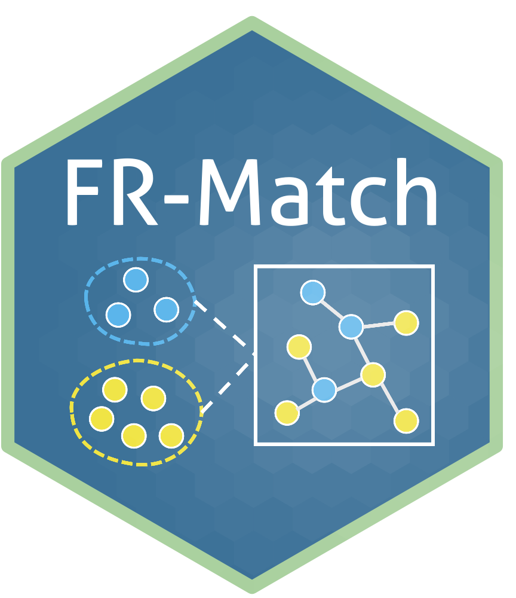

# FR-Match v2.1

__Citation:__ Hu et al. (2026) *bioRxiv* https://pmc.ncbi.nlm.nih.gov/articles/PMC12190912/

__*To contribute, please open an [issue](https://github.com/NLM-DIR/FRmatch/issues) on this Github repository.*__

## Prerequisites

* R
* S4 class data object: [Bioconductor SingleCellExperiment](https://bioconductor.org/packages/release/bioc/html/SingleCellExperiment.html)
* Feature selection: [NS-Forest](https://github.com/NLM-DIR/NSForest)

## Installation

```R
install.packages("devtools")
devtools::install_github("NLM-DIR/FRmatch")
```

## Tutorial

To start with a [tutorial](https://jcventerinstitute.github.io/celligrate/tutorials/FRmatch-vignette.html).


## Versions

Earlier versions are managed in [Releases](https://github.com/NLM-DIR/FRmatch/releases).

Version 2.0:

Zhang et al. (2022) Cell type matching in single-cell RNA-sequencing data using FR-Match. __*Scientific Reports.*__ https://doi.org/10.1038/s41598-022-14192-z

Version 1.0:

Zhang et al. (2020) FR-Match: robust matching of cell type clusters from single cell RNA sequencing data using the Friedman–Rafsky non-parametric test. __*Briefings in Bioinformatics.*__ https://doi.org/10.1093/bib/bbaa339

## Authors

* Beverly Peng (bpeng@jcvi.org)
* Brian Aevermann (baevermann@chanzuckerberg.com)
* Richard Scheuermann (richard.scheuermann@nih.gov)
* Yun (Renee) Zhang (yun.zhang@nih.gov)

## Acknowledgments

* Division of Intramural Research, National Library of Medicine
  
Our collaborators:
* Allen Institute of Brain Science
* Brain Initiative Cell Census Network
* Chan Zuckerberg Initiative
* California Institute for Regenerative Medicine
* J. Craig Venter Institute

